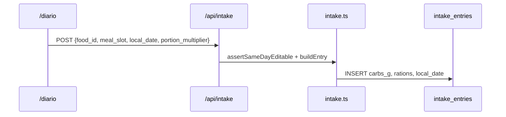

# Design: Commercial Product v1

## Technical Approach

Add `user_profiles` and `intake_entries` on Supabase with RLS mirroring `user_learning_state`. Domain modules own validation, denormalization, and aggregates; API routes stay thin like `/api/progress`. Profile sync extends `auth/callback` and `finalizeAuthenticatedSession` alongside `syncGuestLearningState`. Ship in four chained PRs: profile → intake → export → admin/docs/foods. Clinical features gated by nivel-3 pass, `clinical_mode_enabled`, and optional `CLINICAL_MODE_ENABLED` env.

## Architecture Decisions

| Decision | Choice | Alternatives | Rationale |
|----------|--------|--------------|-----------|
| Intake storage | Normalized `intake_entries`, denormalized `carbs_g`/`rations` at write | JSONB in `user_learning_state`, localStorage | Queryable exports, RLS per user, stable historical values |
| Calendar day / TZ | Client sends `local_date` (`YYYY-MM-DD`) on every write; store on row; same-day CRUD when `entry.local_date === body.local_date` | Server TZ, UTC midnight | Diary matches user's local day; `logged_at` retains audit timestamp; no TZ column in v1 |
| Profile `region_id` | `es` \| `do` (matches `regions.ts`) | Full country strings | Consistent with `REGIONS`, `foodCountry` filter |
| PDF generation | `pdfkit` in Node route handler | `@react-pdf/renderer`, print CSS | Works on Vercel Node runtime; no React-19 renderer peer issues; imperative tables fit clinical report |
| Admin metrics | `get_org_dashboard_stats()` RPC, called only via service role | Client-side aggregates | Single round-trip; scalar aggregates only (spec) |
| Clinical gate | `canUseClinicalMode(progress, profile)` in `guided-flow.ts` | Route-only checks | Reuses `levelCompletions`; unit-testable with existing Vitest patterns |

## Data Flow

```
Login → auth/callback → syncGuestProfile (cookie merge) + syncGuestLearningState
PATCH /api/profile → validate → upsert user_profiles
POST /api/intake → gate → denormalize(food, region.exchangeUnitG) → insert
GET /api/clinical/export → load entries + profile → clinical-report → CSV string | pdfkit stream
Admin → requireContentAdmin → createServiceClient → RPC
```



## File Changes

| File | Action | Description |
|------|--------|-------------|
| `supabase/migrations/20260715140000_commercial_profiles_intake.sql` | Create | `user_profiles`, `intake_entries`, `meal_slot` enum, RLS, indexes, RPC |
| `src/lib/domain/user-profile.ts` | Create | types, validation, `mergeCookieIntoProfile` |
| `src/lib/domain/intake.ts` | Create | denormalize, meal slots, same-day rules |
| `src/lib/domain/clinical-report.ts` | Create | daily/meal/goal/top-food aggregates |
| `src/lib/domain/clinical-export.ts` | Create | CSV builder, `PdfReportDTO` (no layout) |
| `src/lib/domain/guided-flow.ts` | Modify | `hasPassedNivel3`, `canUseClinicalMode` |
| `src/lib/supabase/user-profile.ts` | Create | get/upsert |
| `src/lib/supabase/intake.ts` | Create | CRUD queries |
| `src/lib/onboarding.ts` | Modify | `daily_carb_goal_g` on cookie |
| `src/lib/profile-sync.ts` | Create | `syncGuestProfile`; called from callback + `auth-session` |
| `src/app/api/profile/route.ts` | Create | GET/PATCH |
| `src/app/api/intake/route.ts` | Create | GET (range), POST, PATCH, DELETE |
| `src/app/api/clinical/export/route.ts` | Create | `format`, `range`, file response |
| `src/app/api/admin/metrics/route.ts` | Create | admin gate + service RPC |
| `src/app/diario/page.tsx` | Create | gated diary (Spanish UI) |
| `src/components/ClinicalModePrompt.tsx` | Create | post–nivel-3 opt-in |
| `src/components/OnboardingFlow.tsx` | Modify | carb goal + clinical toggle in `settingsMode` |
| `src/lib/clinical/pdf-layout.ts` | Create | pdfkit template + ES disclaimer |
| `src/app/admin/page.tsx` | Modify | anonymized StatCards |
| `docs/commercial/*` | Create | buyer kit (PR4) |
| `test/domain/{user-profile,intake,clinical-report,clinical-export}.test.ts` | Create | RED-first Vitest |

## Interfaces / Contracts

**`user_profiles`**: `user_id` PK → `auth.users`; `region_id text not null default 'es'`; `daily_carb_goal_g int check (>0)` nullable; `clinical_mode_enabled bool default false`; timestamps.

**`intake_entries`**: `id uuid`; `user_id`; `food_id` → `foods`; `meal_slot` enum (`desayuno|comida|cena|snack`); `logged_at timestamptz`; `local_date date not null`; `portion_multiplier numeric default 1`; `carbs_g`, `rations numeric`. Index `(user_id, local_date)`.

**RLS** (match `user_learning_state`): authenticated `select/insert/update/delete` where `auth.uid() = user_id`.

**`get_org_dashboard_stats()`**: `SECURITY DEFINER`; `REVOKE` from `authenticated`; returns `{ total_users, active_30d, avg_levels_passed, funnel? }` — no user ids/emails/intake.

```ts
function mergeCookieIntoProfile(cookie: OnboardingState, existing?: UserProfile): UserProfileUpsert
// existing non-null fields win over cookie

function canUseClinicalMode(progress: UserProgress, profile: UserProfile): boolean
// nivel-3+ passed AND profile.clinical_mode_enabled AND env CLINICAL_MODE_ENABLED !== 'false'

interface IntakeWrite { food_id: string; meal_slot: MealSlot; local_date: string; portion_multiplier?: number }
interface ClinicalReport { days: DailySummary[]; rollups: Rollup[]; topFoods?: TopFood[]; goalG: number | null }
```

Export: `GET /api/clinical/export?format=csv|pdf&range=7d|30d|custom&from=&to=` — custom ≤90 days; 401 unauthenticated; 403 if gate fails.

## Testing Strategy

| Layer | What | Approach |
|-------|------|----------|
| Unit | merge, denormalize (ES 10g / RD 15g), same-day, aggregates, CSV | `test/domain/*.test.ts`, Vitest RED→GREEN |
| Unit | `canUseClinicalMode`, nivel-3 gate | extend `guided-flow.test.ts` |
| Integration | profile/intake route validation | handler tests with mocked Supabase |
| Component | diary food picker | optional PR2 stretch; not blocking MVP |

## Threat Matrix

N/A — no routing/shell/subprocess/VCS/executable-file/process-integration boundary. Standard Next.js handlers; RLS + auth gate own-data access.

## Migration / Rollout

1. Apply additive migration. 2. Deploy with `CLINICAL_MODE_ENABLED=true` (default). Set `false` to hide `/diario`, export, and clinical settings without touching education. 3. Rollback: flag off first; down-migrate tables if required.

## Chained PR Strategy

| PR | Scope |
|----|-------|
| **1** | `user_profiles` migration, domain+API+settings, `syncGuestProfile`, extend onboarding cookie |
| **2** | `intake_entries` migration, intake domain+API, `/diario`, `ClinicalModePrompt` |
| **3** | `clinical-report`/`clinical-export`, pdfkit, export button on `/diario` or `/progress` |
| **4** | admin RPC+metrics UI, `docs/commercial/`, foods ~80–100/country seed |

Each PR autonomous, <400 authored lines, tests included per `strict_tdd`.

## Open Questions

None blocking. RD guided-lesson localization remains buyer-doc positioning per proposal.
